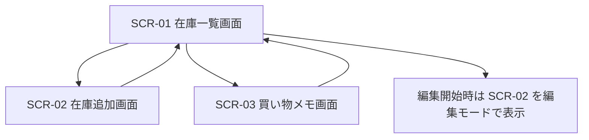

# うちの在庫ノート 外部設計書

## 1. 目的

家庭内の在庫を画面ごとに役割分担して管理し、不足品と期限切れを誤認なく把握できるようにする。

## 2. 対象利用者

- 家庭内の在庫を整理したい一般利用者
- 買い物前に補充対象だけ確認したい利用者

## 3. システム概要

本システムは、フロントエンドから在庫情報を登録・参照し、サーバーが集約済みの表示用データを返す家庭向け在庫管理アプリである。

- フロントエンド: React
- バックエンド: Laravel API
- データベース: MySQL

## 4. 画面一覧

| 画面ID | 画面名 | 概要 |
| --- | --- | --- |
| SCR-01 | 在庫一覧画面 | 品名集約一覧、検索、カテゴリ絞り込み、数量更新、編集、削除を行う |
| SCR-02 | 在庫追加画面 | 在庫登録と在庫編集を行う |
| SCR-03 | 買い物メモ画面 | 不足品を品名単位で確認する |

## 5. 画面設計

### 5.1 共通ナビゲーション

#### 5.1.1 画面概要

画面上部に `在庫一覧` `在庫追加` `買い物メモ` のナビゲーションを表示し、用途ごとに画面を切り替える。

#### 5.1.2 表示項目

| 項目名 | 内容 |
| --- | --- |
| 画面タイトル | 現在表示中の画面名 |
| ナビゲーションボタン | 3 画面を切り替える |

### 5.2 SCR-01 在庫一覧画面

#### 5.2.1 画面概要

品名単位で集約した在庫を確認し、検索、絞り込み、数量更新、編集、削除を行う。

#### 5.2.2 画面構成

1. 検索・絞り込み領域
2. 集約在庫一覧領域
3. 期限別明細領域

#### 5.2.3 表示項目

| 項目名 | 内容 |
| --- | --- |
| 表示件数 | 現在表示している品名件数 |
| 品名 | 品名単位の集約名 |
| カテゴリ | 単一カテゴリならカテゴリ名、複数なら `複数カテゴリ` |
| 保管場所 | 単一保管場所なら保管場所名、複数なら `複数の保管場所` |
| 実効在庫数 | 期限切れ除外後の数量 |
| 登録在庫数 | 期限切れを含む登録数量 |
| 合計下限 | 同品名の下限合計 |
| 在庫件数 | 期限別在庫件数 |
| 最短期限 | 最も近い期限 |
| タグ | `不足` `期限近い` `期限切れあり` |
| 期限別明細 | 期限ごとの在庫行 |

#### 5.2.4 入力項目

| 項目名 | 必須 | 形式 | 説明 |
| --- | --- | --- | --- |
| 検索キーワード | 任意 | 文字列 | 品名、メモ、カテゴリ、保管場所を対象に検索 |
| カテゴリ絞り込み | 任意 | 選択 | カテゴリ単位の絞り込み条件 |

#### 5.2.5 操作一覧

| 操作 | 説明 |
| --- | --- |
| 検索入力 | 一覧をキーワードで再取得する |
| カテゴリ選択 | 一覧をカテゴリで再取得する |
| 期限別の明細を見る | 同品名の期限別在庫を展開する |
| 編集 | 対象在庫を在庫追加画面の編集モードで開く |
| `-1` | 対象在庫の数量を 1 減らす |
| `+1` | 対象在庫の数量を 1 増やす |
| 削除 | 対象在庫を削除する |

#### 5.2.6 表示ルール

- 一覧は品名単位で 1 行に集約する
- 同品名でも期限別在庫は明細で分けて表示する
- 期限切れ在庫は実効在庫数に含めない
- 同品名の不足判定は実効在庫数合計と下限合計で行う
- 期限切れ在庫がある場合は `期限切れあり` タグを表示する
- 在庫 1 件だけの集約行では明細を初期表示する

### 5.3 SCR-02 在庫追加画面

#### 5.3.1 画面概要

在庫の新規登録と編集を行う。編集開始時は一覧画面から本画面へ遷移する。

#### 5.3.2 入力項目

| 項目名 | 必須 | 形式 | 説明 |
| --- | --- | --- | --- |
| 品名 | 必須 | 文字列 | 在庫名 |
| カテゴリ | 必須 | 選択 | カテゴリマスタから選択 |
| 保管場所 | 必須 | 選択 | 保管場所マスタから選択 |
| 数量 | 必須 | 数値 | 0 以上の整数 |
| 単位 | 必須 | 文字列 | 例: 個、本、袋 |
| 下限 | 必須 | 数値 | 補充目安となる数量 |
| 賞味・使用期限 | 任意 | 日付 | 期限日 |
| メモ | 任意 | 文字列 | 補足情報 |

#### 5.3.3 操作一覧

| 操作 | 説明 |
| --- | --- |
| 在庫に追加 | 新規在庫を登録する |
| 在庫を更新 | 編集中在庫の内容を更新する |
| 編集をやめる | 編集モードを解除して一覧画面へ戻る |

### 5.4 SCR-03 買い物メモ画面

#### 5.4.1 画面概要

不足品だけを品名単位で表示する。

#### 5.4.2 表示項目

| 項目名 | 内容 |
| --- | --- |
| 品名 | 買い足し対象の品名 |
| 残り数量 | 期限切れ除外後の合計在庫数 |
| 合計目標 | 同品名の下限合計 |
| 期限切れ除外数量 | 期限切れとして在庫数に含めていない数量 |

#### 5.4.3 表示ルール

- 同じ品名は 1 行にまとめて表示する
- 不足判定は合計在庫数と合計下限で行う
- 期限切れ除外数量が 0 より大きい場合のみ表示する

## 6. 機能一覧

| 機能ID | 機能名 | 概要 |
| --- | --- | --- |
| F-01 | 初期表示 | マスタとダッシュボード情報を取得して画面表示する |
| F-02 | 在庫登録 | 在庫追加画面から在庫を登録する |
| F-03 | 在庫編集 | 一覧から対象在庫を編集モードで開き更新する |
| F-04 | 在庫一覧表示 | 品名集約された在庫一覧を表示する |
| F-05 | 在庫検索 | キーワードで在庫一覧を再取得する |
| F-06 | カテゴリ絞り込み | カテゴリで在庫一覧を再取得する |
| F-07 | 数量更新 | 一覧から数量を増減する |
| F-08 | 在庫削除 | 一覧から在庫を削除する |
| F-09 | 買い物メモ表示 | 不足品を買い物メモ画面に表示する |

## 7. 入出力インターフェース設計

### 7.1 API 一覧

| API ID | メソッド | パス | 用途 |
| --- | --- | --- | --- |
| API-01 | GET | `/api/inventory-metadata` | カテゴリ、保管場所マスタ取得 |
| API-02 | GET | `/api/inventory-dashboard` | 一覧表示用在庫、集約結果、買い物メモ、集計取得 |
| API-03 | GET | `/api/inventory-items` | 在庫明細取得 |
| API-04 | POST | `/api/inventory-items` | 在庫新規登録 |
| API-05 | PATCH | `/api/inventory-items/{inventoryItem}` | 在庫更新 |
| API-06 | DELETE | `/api/inventory-items/{inventoryItem}` | 在庫削除 |

### 7.2 API 詳細

#### API-01 カテゴリ・保管場所取得

- メソッド: `GET`
- パス: `/api/inventory-metadata`

#### API-02 ダッシュボード取得

- メソッド: `GET`
- パス: `/api/inventory-dashboard`
- クエリ:
  - `search`: 任意
  - `categoryId`: 任意

レスポンス例:

```json
{
  "data": {
    "items": [
      {
        "id": "uuid",
        "name": "りんご",
        "categoryId": "uuid",
        "categoryName": "食品",
        "storageLocationId": "uuid",
        "storageLocationName": "常温",
        "quantity": 1,
        "effectiveQuantity": 0,
        "threshold": 2,
        "unit": "個",
        "expiresAt": "2026-02-27",
        "daysUntilExpiration": -1,
        "isExpired": true,
        "isExpiringSoon": false,
        "updatedAt": "2026-02-28T00:00:00.000Z",
        "note": "期限切れ"
      }
    ],
    "groupedItems": [
      {
        "id": "りんご",
        "name": "りんご",
        "categoryName": "食品",
        "storageLocationName": "常温",
        "quantity": 1,
        "registeredQuantity": 2,
        "threshold": 3,
        "unit": "個",
        "note": "期限切れ",
        "entryCount": 2,
        "expiredCount": 1,
        "expiredQuantity": 1,
        "nearestExpiresAt": "2026-02-27",
        "nearestExpirationDays": -1,
        "hasExpiredItems": true,
        "lowStock": true,
        "expiringSoon": false,
        "items": []
      }
    ],
    "shoppingList": [
      {
        "name": "りんご",
        "quantity": 1,
        "expiredQuantity": 1,
        "threshold": 3,
        "unit": "個"
      }
    ],
    "summary": {
      "lowStock": 2,
      "expiringSoon": 1,
      "totalQuantity": 4
    }
  }
}
```

#### API-03 在庫明細取得

- メソッド: `GET`
- パス: `/api/inventory-items`

#### API-04 在庫新規登録

- メソッド: `POST`
- パス: `/api/inventory-items`

#### API-05 在庫更新

- メソッド: `PATCH`
- パス: `/api/inventory-items/{inventoryItem}`

#### API-06 在庫削除

- メソッド: `DELETE`
- パス: `/api/inventory-items/{inventoryItem}`

## 8. バリデーション設計

| 項目 | ルール |
| --- | --- |
| 品名 | 必須、255 文字以内 |
| カテゴリID | 必須、UUID、カテゴリマスタに存在すること |
| 保管場所ID | 必須、UUID、保管場所マスタに存在すること |
| 数量 | 必須、整数、0 以上 |
| 下限 | 必須、整数、0 以上 |
| 単位 | 必須、30 文字以内 |
| 期限 | 任意、日付形式 |
| メモ | 任意、1000 文字以内 |

## 9. エラー表示方針

- 利用者には技術名を表示しない
- 通信失敗時は「サーバーが応答しません。管理者に問い合わせてください。」または「時間をおいて再度お試しください。」を表示する
- 入力不足時は送信しない
- 更新失敗時は編集中状態を維持する

## 10. 非機能要件

### 10.1 操作性

- 役割ごとに画面を分けること
- スマートフォン幅でも利用できること

### 10.2 可用性

- サーバー未応答時は画面が異常終了せず、利用者向けメッセージを表示すること

### 10.3 保守性

- 表示用の集約計算はバックエンド側に集約すること
- フロントエンドは API の応答を表示する責務を中心とすること

## 11. 画面遷移


