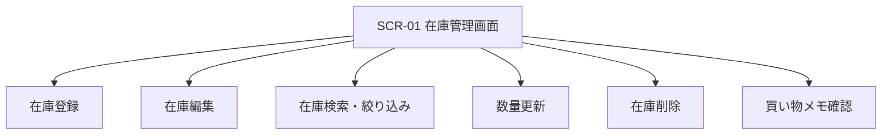

# うちの在庫ノート 外部設計書

## 1. 目的

家庭内の食品や日用品の在庫を一元管理し、残量不足や期限切れ前の品目を把握しやすくする。

## 2. 対象利用者

- 家庭内の買い置きや備蓄を管理したい一般利用者
- 補充対象を見ながら買い物したい利用者

## 3. システム概要

本システムは、フロントエンドから在庫情報を登録・参照し、サーバー経由で在庫データを保存する家庭向け在庫管理アプリである。

- フロントエンド: React
- バックエンド: Laravel API
- データベース: MySQL

## 4. 画面一覧

| 画面ID | 画面名 | 概要 |
| --- | --- | --- |
| SCR-01 | 在庫管理画面 | 在庫登録、在庫編集、在庫一覧表示、検索、絞り込み、数量更新、削除、買い物メモ表示を行う |

## 5. 画面設計

### 5.1 SCR-01 在庫管理画面

#### 5.1.1 画面概要

1 画面で在庫登録、在庫編集、在庫確認、買い物メモ確認を行う。

#### 5.1.2 画面構成

1. ヘッダー領域
2. サマリー領域
3. 在庫登録フォーム領域
4. 在庫一覧領域
5. 買い物メモ領域

#### 5.1.3 表示項目

| 項目名 | 内容 |
| --- | --- |
| タイトル | アプリ名を表示する |
| 状態メッセージ | 読み込み状況や更新結果を一般ユーザー向け文言で表示する |
| 不足気味件数 | `数量 <= 下限値` の件数を表示する |
| 期限が近い件数 | 期限が 7 日以内の件数を表示する |
| 総数量 | 在庫数量の合計を表示する |
| 在庫一覧件数 | 現在表示中の在庫件数を表示する |
| 買い物メモ | 補充対象の在庫を一覧表示する |
| フォームモード | 新規登録中か編集中かを表示する |

#### 5.1.4 入力項目

| 項目名 | 必須 | 形式 | 説明 |
| --- | --- | --- | --- |
| 品名 | 必須 | 文字列 | 在庫名 |
| カテゴリ | 必須 | 選択 | DB のカテゴリマスタから取得 |
| 保管場所 | 必須 | 選択 | DB の保管場所マスタから取得 |
| 数量 | 必須 | 数値 | 0 以上の整数 |
| 単位 | 必須 | 文字列 | 例: 個、本、袋 |
| 下限 | 必須 | 数値 | 補充目安となる数量 |
| 賞味・使用期限 | 任意 | 日付 | 期限日 |
| メモ | 任意 | 文字列 | 補足情報 |
| 検索キーワード | 任意 | 文字列 | 品名、メモ、カテゴリ、保管場所で検索 |
| カテゴリ絞り込み | 任意 | 選択 | 在庫一覧の絞り込み条件 |

#### 5.1.5 操作一覧

| 操作 | 説明 |
| --- | --- |
| 在庫に追加 | 入力内容を登録する |
| 編集ボタン | 対象在庫の内容をフォームへ読み込み、編集モードへ切り替える |
| 在庫を更新 | 編集中の在庫内容を更新する |
| 編集をやめる | 編集モードを解除して新規登録モードへ戻る |
| `-1` ボタン | 対象在庫の数量を 1 減らす |
| `+1` ボタン | 対象在庫の数量を 1 増やす |
| 削除ボタン | 対象在庫を削除する |
| 検索入力 | 在庫一覧をキーワードで絞り込む |
| カテゴリ選択 | 在庫一覧をカテゴリで絞り込む |

#### 5.1.6 表示ルール

- 不足在庫は「不足」タグを表示する
- 期限が 7 日以内の在庫は「期限近い」タグを表示する
- 期限未設定の場合は「期限設定なし」と表示する
- 編集モード中はフォーム見出しと送信ボタン文言を更新用に切り替える
- 在庫が 0 件の場合は空状態メッセージを表示する

#### 5.1.7 並び順

在庫一覧は以下の優先順位で表示する。

1. 不足在庫を先頭表示
2. 期限が近い順
3. 品名昇順

## 6. 機能一覧

| 機能ID | 機能名 | 概要 |
| --- | --- | --- |
| F-01 | 初期表示 | カテゴリ、保管場所、在庫一覧を取得して画面に表示する |
| F-02 | 在庫登録 | 入力フォームから在庫を新規登録する |
| F-03 | 在庫編集 | 一覧から選択した在庫をフォームへ読み込み、内容を更新する |
| F-04 | 在庫一覧表示 | 在庫を一覧表示する |
| F-05 | 在庫検索 | キーワードで在庫を絞り込む |
| F-06 | カテゴリ絞り込み | カテゴリ単位で在庫を絞り込む |
| F-07 | 数量更新 | ボタン操作で数量を増減する |
| F-08 | 在庫削除 | 不要在庫を削除する |
| F-09 | 買い物メモ表示 | 下限以下の在庫を買い物メモとして表示する |

## 7. 入出力インターフェース設計

### 7.1 API 一覧

| API ID | メソッド | パス | 用途 |
| --- | --- | --- | --- |
| API-01 | GET | `/api/inventory-metadata` | カテゴリ、保管場所マスタ取得 |
| API-02 | GET | `/api/inventory-items` | 在庫一覧取得 |
| API-03 | POST | `/api/inventory-items` | 在庫新規登録 |
| API-04 | PATCH | `/api/inventory-items/{inventoryItem}` | 在庫更新 |
| API-05 | DELETE | `/api/inventory-items/{inventoryItem}` | 在庫削除 |

### 7.2 API 詳細

#### API-01 カテゴリ・保管場所取得

- メソッド: `GET`
- パス: `/api/inventory-metadata`

レスポンス例:

```json
{
  "data": {
    "categories": [
      { "id": "uuid", "name": "食品", "slug": "foods" }
    ],
    "storageLocations": [
      { "id": "uuid", "name": "常温", "slug": "room-temperature" }
    ]
  }
}
```

#### API-02 在庫一覧取得

- メソッド: `GET`
- パス: `/api/inventory-items`

レスポンス例:

```json
{
  "data": [
    {
      "id": "uuid",
      "name": "お米",
      "categoryId": "uuid",
      "categoryName": "食品",
      "storageLocationId": "uuid",
      "storageLocationName": "常温",
      "quantity": 1,
      "threshold": 2,
      "unit": "袋",
      "expiresAt": null,
      "updatedAt": "2026-02-28T00:00:00.000Z",
      "note": "5kg"
    }
  ]
}
```

#### API-03 在庫新規登録

- メソッド: `POST`
- パス: `/api/inventory-items`

リクエスト:

```json
{
  "name": "お米",
  "categoryId": "uuid",
  "storageLocationId": "uuid",
  "quantity": 1,
  "threshold": 2,
  "unit": "袋",
  "expiresAt": "2026-03-10",
  "note": "特売品"
}
```

#### API-04 在庫更新

- メソッド: `PATCH`
- パス: `/api/inventory-items/{inventoryItem}`

更新対象:

- 数量更新
- カテゴリ変更
- 保管場所変更
- 期限変更
- メモ変更
- 単位、下限、品名の変更

#### API-05 在庫削除

- メソッド: `DELETE`
- パス: `/api/inventory-items/{inventoryItem}`

## 8. バリデーション設計

| 項目 | ルール |
| --- | --- |
| 品名 | 必須、255 文字以内 |
| カテゴリID | 必須、UUID、カテゴリマスタに存在すること |
| 保管場所ID | 必須、UUID、保管場所マスタに存在すること |
| 数量 | 必須、整数、0 以上 |
| 下限 | 必須、整数、0 以上 |
| 単位 | 必須、30 文字以内 |
| 期限 | 任意、日付形式 |
| メモ | 任意、1000 文字以内 |

## 9. エラー表示方針

- 利用者には技術名を表示しない
- 通信失敗時は「サーバーが応答しません。管理者に問い合わせてください。」と表示する
- 更新失敗時は「時間をおいて再度お試しください。」を基本とする
- 入力不足時は送信を行わず、操作対象を維持する

## 10. 非機能要件

### 10.1 操作性

- 1 画面で主要操作を完結できること
- スマートフォン幅でも利用できること

### 10.2 可用性

- サーバー未応答時は画面が異常終了せず、利用者向けメッセージを表示すること

### 10.3 保守性

- フロントエンドはコンポーネント、フック、サービス、ユーティリティに責務分離すること
- テストで主要な状態遷移と画面操作を担保すること

## 11. 画面遷移

本システムは単一画面構成とする。


